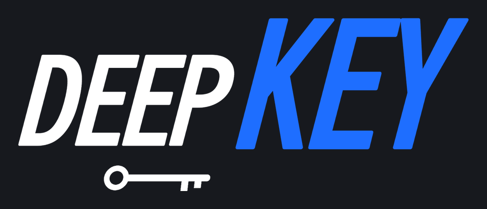

# DeepKey 过场动画

DEEP / KEY 字样与钥匙依次进入，钥匙跳起翻转，扫光后由蓝色斜带完成全屏转场。含拖影、运动模糊和同步合成音效。



## 运行

先按[仓库安装说明](../README.md#安装)安装 Python 依赖和 FFmpeg。以下命令从仓库根目录执行，需已激活虚拟环境：

```bash
python deepkey-transition/render_v2.py
```

入口是 `render_v2.py`，没有命令行参数。它同时依赖本目录的 `dk_core.py`、`sfx.py` 和字体。不要只复制入口文件。

## 输出

输出文件写在 `deepkey-transition` 目录，重复运行会覆盖同名文件：

| 文件 | 内容 |
| --- | --- |
| `DeepKey过场_v2_透明通道_ProRes4444.mov` | 1920 × 1080、60fps、2.5 秒；透明 ProRes 4444，24-bit PCM 音轨 |
| `DeepKey过场_v2_绿幕_1080p60.mp4` | 同尺寸、帧率和时长；H.264 绿幕视频，AAC 音轨 |
| `DeepKey过场_v2_音效.wav` | 48kHz、24-bit、立体声、3.7 秒；含混响尾巴 |

视频内音效裁至 2.5 秒，并在末尾 0.12 秒淡出。独立 WAV 保留较长尾音，适合在剪辑软件中自行控制。MOV 使用 Straight / 非预乘 alpha；若剪辑软件需要手动指定透明通道模式，选择 Straight。MP4 本身不带透明通道，需要抠绿。

## 修改

- `render_v2.py`：`FPS`、`DUR`、`SUB`（每帧运动模糊采样数，默认 8）、位置、转场时间、运动曲线和音效时间点。
- `dk_core.py`：`W`、`H`、颜色、字体、DEEP / KEY 文字、钥匙形状和绘图合成函数。
- `sfx.py`：气流、叮声、扫光、蓄力、落点和混响合成；随机种子固定为 7，每次新启动脚本从相同状态开始。

原始动作针对 1080p 和 2.5 秒设计，分辨率和总时长并不是自动适配参数。修改它们时，需要同时检查镜头位移、色带宽度、覆盖时刻、音效时间点和输出文件名；`DUR` 不会自动缩放全部动作。降低 `SUB` 可以减少渲染耗时，也会改变运动模糊效果。

当前源码为 60fps，历史 30fps 成片不随仓库提供。复现历史版本时应重新匹配参数，并检查动作与音效。

## 文件与字体

`fonts/SmileySans-Oblique.ttf` 为得意黑，字体从本目录读取。所有图形和音效由代码生成，无需外部视频、参考 PNG 或 WAV。

源码采用[项目 MIT 许可证](../LICENSE)，字体采用 `fonts/OFL-SmileySans.txt` 中的 SIL OFL 1.1。
